# Entropic Labs

Landing page for Entropic Labs, a recording and production studio run by **Despite the Finite**.

**Live site:** https://despite-the-finite.github.io/Entropic-Labs/

## Contents

- `index.html` — the desktop site: markup, styles, and scripts in one file, with images loaded from `img/`.
- `m/` — the mobile build, served automatically to phones (see below).
- `img/` — the site's photography, at two sizes each: full for desktop, `-mobile` for phones, plus the hero's figure sprites.
- `hero.js` — the hero banner's live layers, shared by both builds (see below).
- `games.html` — the games page: video game design as a minor function of the studio.
- `observatory.html` + `observatory/` — the Observatory: an interactive star chart of things worth wondering about. One responsive page rather than a desktop page plus an `m/` twin; see below.
- `butterfly.html` + `butterfly/` — Butterfly Trails: an interactive family archive, built around what small moments led to. Same single-responsive-page arrangement as the Observatory; see below.
- `play/meridian/` — a hosted copy of *Donnell and McBurns: An EPC Epic*, so it's playable straight from the site. Read-only; see `play/meridian/UPSTREAM.md` for the source commit and how to refresh it.
- `play/wandering-words/` — a hosted copy of *Indra and the Wandering Words*, same arrangement; see `play/wandering-words/UPSTREAM.md`.
- `entropic-labs-banner.svg` — the banner at the top of this README.
- `.nojekyll` — tells GitHub Pages to serve every file as-is, without running the content through Jekyll.

## Editing

Open `index.html` in a browser to preview, or in any editor to make changes. There's no build step — commit and push to `main`, and GitHub Pages picks up the change automatically within a minute or two.

Content lives in two places now, so a copy change to a section usually needs the same
edit in `m/`. Preview the mobile build with a local server (`npx http-server -s .`)
and your browser's device toolbar, since the redirect below keys off the device.
The Observatory and Butterfly Trails are the exceptions — each is a single
responsive page, so their content is edited once, in
`observatory/data/observations.js` and `butterfly/data/stories.js`.

## Mobile

Phones get `m/` instead of the desktop pages, decided by a short script in the
`<head>` of `index.html` and `games.html`. It treats a visitor as mobile on any of
three signals: `navigator.userAgentData.mobile`, a phone user-agent string, or a
viewport of 820px or less with a coarse pointer. Small tablets match that last one
too, which is intended — the mobile layout suits them. A desktop with a touchscreen
does not, because its viewport is wider than 820px.

- Deep links survive: `index.html#gear` lands on `m/#gear`.
- **Opting out:** the mobile pages link to `?full=1`, which pins the full site in
  `localStorage` for that browser and follows you across pages.
- **Opting back in:** loading anything under `m/` clears the pin. The desktop footer
  has a "Mobile site" link for that.

The mobile build is deliberately not just narrower CSS: the gear list becomes cards
instead of a table that scrolls sideways, the nav becomes a full-screen menu, buttons
are full-width at 52px, the long game write-ups sit behind a "Read more" disclosure,
and it loads the `-mobile` images (191KB for all three, against 640KB).

`m/mobile.css` is shared by both mobile pages rather than inlined, so it's cached
once across them.

## The hero banner

The artwork arrived as one flat 4K image, and nothing in a flat image can move.
So `img/hero.jpg` is a **backdrop with the animated parts painted out** — the
strapline, the spectrum bars and the five figures — and those are layered back
over it as live elements:

| Element | How it lives now |
|---|---|
| Spectrum bars | Drawn into `.hero-fx` canvas, three detuned oscillators per bar so it reads as music rather than a wave. Colour ramp sampled from the original. |
| Falling code | Same canvas. Extra glyph columns fall through the static ones already in the artwork. |
| Strapline | Live SVG text over the erased band, turning slowly on its own axis. |
| The five figures | Cut out of the artwork as sprites in `img/hero-fig-*.png` and screen-blended back at their exact positions. Each has its own animation: the biker takes bumps, the cyclist pedals, the skateboarder ollies, the snowboarder carves, the truck works its suspension. |

Figures animate **on hover** where there's a pointer, and **take turns
automatically** on touch, since a phone has no hover. Positions are in percent of
the banner, so every layer stays registered at any width, and the slow push
scales the whole scene rather than the backdrop alone.

`layers.py` in the scratchpad produced the separation: it finds each figure by
its glow, inpaints it out of the plate, and writes the sprite as the difference
between original and plate — so a sprite composited at rest reproduces the
source exactly. Re-running it needs the original 4K file.

The canvas is capped at 30fps, stops when the tab is hidden or the hero scrolls
out of view, and draws a single frozen frame under `prefers-reduced-motion`,
where every animation is off.

## Sections

- Hero — the `ENTROPIC LABS / MUSIC ENGINEERING / STUDIO` backdrop, plus the booking CTA
- Manifesto — studio philosophy
- Behind the board — lead producer bio
- Inside the room — studio photo
- Gear list — recording equipment
- Projects — placeholder catalog for upcoming releases
- Side room — game design as a minor function, linking out to `games.html`
- The observatory — curiosity as the third room, linking out to `observatory.html`
- Butterfly Trails — the family archive, linking out to `butterfly.html`
- Contact — booking terms and hours only; see the note below

## Contact details

**No contact details live in this repo — keep it that way.** Anything a browser can
render, a visitor or a scraper can read; encoding a value only hides it from the
person reading the page, not from anyone who looks at the source. The contact
section therefore carries booking terms, hours, and the fact that the location is
shared once a session is confirmed, and nothing else. The "Book a session" buttons
scroll to that section rather than opening a mail client.

To take bookings, add a hosted form (Formspree, Tally, a Google Form) and point the
buttons at it — the form provider holds the address, so the page never publishes one.

## Games page

`games.html` covers the studio's game design work, in order:

1. **Donnell and McBurns: An EPC Epic** — playable at [`/play/meridian/`](https://despite-the-finite.github.io/Entropic-Labs/play/meridian/)
2. **Indra and the Wandering Words** — playable at [`/play/wandering-words/`](https://despite-the-finite.github.io/Entropic-Labs/play/wandering-words/)
3. **Live Trivia**

The site no longer links to any game's source. Each hosted copy still records where
it came from in its own `UPSTREAM.md`, which is what a refresh needs.

Each entry is a disclosure: the catalog reads as three concise rows, and picking one
opens its three-paragraph write-up along with its play button. That's
plain `<details>`/`<summary>`, so it needs no JavaScript and stays keyboard
accessible.

The first two are playable on the site itself: both are entirely static — Meridian
vendors Phaser 3 locally and generates all its art procedurally at boot, and the
reading game is classic script tags with inline SVG art and synthesised audio — so
GitHub Pages serves them with no build step.

**Live Trivia** can't be hosted the same way: its frontend calls `/api/*` with
Postgres behind it, so a static copy would only ever show its offline screen.
Deploying it (Vercel plus a Postgres URL and an Anthropic API key) would give it a
**Play it now** button too — drop the URL into `games.html` in place of the
`play-note` beside its link.

Dirty Bass, the in-house VST3 synth, is listed on the studio side in the gear
table instead of here — it loads in a DAW rather than a browser, so it has no
play link, just a link to its source.

## The Observatory

`observatory.html` is the third room. Studio is what gets made, Games is what
gets played, and the Observatory is what gets wondered about: an interactive
star chart where each star is a catalogued observation, from cities found under
the Amazon to why the galaxy is so quiet.

```
observatory.html            the shell
observatory/
  observatory.css           styles — the site palette, one stop darker
  data/observations.js      ALL the content: categories + observations
  telemetry.js              moon phase, Voyager range, clock — pure functions
  starfield.js              canvas engine: camera, parallax, hit-testing
  observatory.js            controller: state machine, routing, panels
```

**Adding an observation** means appending one object to `OBSERVATIONS` in
`observatory/data/observations.js`. Nothing else needs touching — the star map
places it on its field's ring automatically, the catalogue lists it, the record
view renders whichever fields are present, and the counter in the status panel
picks it up. Adding a whole new field of curiosity means appending to
`CATEGORIES` with a position in chart space. The field list at the top of that
file documents every supported key.

**Routing** is the URL: `#lost-civilizations` opens a field, `#obs-0047` opens
a record, `#unidentified` opens the anomaly. Every record is linkable and the
back button behaves.

**No `m/` twin, on purpose.** The other pages are prose, so a hand-tuned mobile
copy is cheap and worth it. This one is a canvas app whose layout is computed at
runtime from the viewport and pointer type, and a second copy would only ever
drift out of sync. Instead it branches internally: portrait squeezes the chart
horizontally and stretches it vertically rather than scaling it down, panels
become bottom sheets, observation labels are always drawn on touch instead of
on hover, and the panel-clearance maths measures the open panel rather than
assuming a breakpoint. Both `index.html` and `m/index.html` link straight here;
because this page carries no redirect script, it is safe to enter from either.

**Telemetry** is computed in the browser with no network calls. The moon phase
uses the standard low-precision astronomical solution and lands on published
new and full moons to the percentage point. Voyager 1's range is extrapolated
from a dated reference constant at the top of `telemetry.js` — back-extrapolate
it to the 2012 heliopause crossing and it gives 121.8 AU against the published
~121, so it stays right on its own rather than needing manual edits. Each row
is labelled live, computed, or nominal, and the panel says which is which.

**Content rules.** Every record carries a `certainty` block that separates
ESTABLISHED from HYPOTHESIS, CONTESTED, UNRESOLVED and SPECULATION, because the
point of the room is that most of this is unfinished. Source links point at the
publishing journal or institution rather than deep links, so they keep working;
the citation itself names the specific paper.

**Performance.** No frameworks and no dependencies. One pre-rendered glow
sprite instead of per-star gradients, background stars as plain fillRects, and
the loop idles at ~30fps, rises to full rate only while something is moving,
and stops dead when the tab is hidden. Under `prefers-reduced-motion` it drops
drift, twinkle and camera easing entirely and draws on demand only — zero
background frames.

**The anomaly.** There is one unidentified object on the chart, marked `?`. It
opens a deliberately incomplete record pointing at Sublevel −1, which does not
exist yet. That is the intended state: a doorway, not a room. Its presentation
is the `special: 'anomaly'` branch in `observatory.js`.

## Butterfly Trails

`butterfly.html` is the fourth room, and the only one that is not about the
studio. The Studio is what gets made, Games is what gets played, the
Observatory is what gets wondered about, and Butterfly Trails is what made the
person doing all of it: a family archive built around consequence rather than
chronology. The premise is the butterfly effect — that a life turns on moments
too small to notice at the time — so every story is a point on a longer path,
and the room exists to show what each point led to.

```
butterfly.html              the shell
butterfly/
  butterfly.css             styles — the site palette, one room warmer
  data/stories.js           ALL the content: stories, categories, eras, places
  trails.js                 canvas engine: camera, layouts, butterflies, hit-testing
  butterfly.js              controller: archive, state machine, routing, panels
```

**The trail is a braid.** Two lives run alongside each other, converge when
they marry, and divide again each time somebody is born — so the spine of the
room is five strands rather than one line, defined in `STRANDS`. A story's
optional `strand` field says whose line it happened on; leave it out and the
story sits on the centre line, which is right for anything belonging to the
family rather than to one person in it.

The geometry is measured from the trunk rather than from zero: a parent's
offset decays to nothing at the union and a child's grows from nothing at its
birth year, so the joins are exact by construction and the wobble that keeps
the lines organic dies away to nothing exactly where two lines have to touch.
Time is a compressed axis — a year is worth a fixed distance, but no gap can
collapse to nothing or run away, so three years between two births reads as a
real gap while forty empty years do not push everything off the screen.

`BRAID.unionYear` is deliberately `null`: nobody has supplied the year of the
marriage, and putting a number there would be inventing one. Left null the
strands still converge, with the confluence sitting before the first birth and
carrying no date — the honest drawing of "this happened, we haven't written
down when". Fill the year in and the whole braid re-times itself around it.
Adding a third child means one more entry in `STRANDS` with the year it
begins; nothing else needs editing.

**Adding a story** means appending one object to `STORIES` in
`butterfly/data/stories.js`. Nothing else needs touching. The trail places it
on its strand at its year, the constellation clusters it with its era, the map
plots it if it has coordinates, its category butterfly learns it has somewhere
to fly, the era rail picks up its era, and every counter updates. Every field
except `id` is optional and the room degrades quietly: a story with a title
and nothing else renders, it just renders sparely. The field list at the top
of that file documents every supported key.

**Causality is the point.** `causedBy` and `consequences` state the edges;
reciprocal links are filled in automatically at load, so each edge is written
once in whichever direction reads better. A story with consequences grows a
**Because of this…** section that will walk the chain — camera following a
butterfly from one memory to the next, lighting each edge as it goes. That is
the mechanic the whole room is built to serve: start at an ordinary moment and
follow it until it reaches somebody who wasn't born yet.

**Alternate paths.** A story that turned on a decision can carry an
`alternatePath` with two choices, exactly one marked `taken`. The reader is
invited to guess; guessing wrong grows a dashed violet branch off the node and
shows the untaken outcome under the heading *A life that never happened*,
followed by *But that's not what happened.* Hypothetical text only ever comes
from the data — nothing about the branch is generated, and if the untaken
outcome is missing the plate says so rather than inventing one.

**Flags.** `classified`, `disputed` and `chaosEvent` are optional metadata. A
classified story shows its title, its seal and no story text at all — the text
is not rendered rather than hidden, so it is not sitting in the page source.

**The essay.** "What is the butterfly effect?" under the title opens a sourced
article on where the idea comes from — Lorenz's 1961 rounding error, the 1972
talk whose title somebody else wrote, what sensitive dependence actually says
and what it does not — and on the 2004 Eric Bress / J. Mackye Gruber film with
Ashton Kutcher, which is where most people have the phrase from. It reads in
the Observatory's teal rather than the room's amber, because it is the
checkable kind of writing rather than the remembered kind, and it carries
citations for the same reason. It lives in `ARCHIVE.essay` with the rest of
the writing and is linkable at `butterfly.html#butterfly-effect`.

**Three layouts, one node list.** Every memory carries a trail position, a
constellation position and (if it has coordinates) a map position, and eases
between them, so changing view is a migration rather than a cut. The map is a
graticule, not a world map: drawing coastlines from memory would mean inventing
geography, so it plots latitude and longitude honestly against meridians and
parallels and lets the migration arcs carry the meaning. It also says out loud
how many memories have no place yet.

**Routing** is the URL: `#whole-trail` and `#map` are the wide views, and any
story id opens that memory (`butterfly.html#the-letter`). Story ids are
resolved before view names, so no route can ever shadow a memory. Following a
butterfly and jumping to an era are actions rather than destinations and
deliberately leave no history behind.

**The empty state is a state, not a hole.** With no stories the trail is a
faint path arriving out of the dark with a handful of unidentified points on
it that surface and fade. Category butterflies still fly — they look, fail to
find anything, and say so — and Surprise Me sends several out searching before
they give up. Nothing is ever populated with invented content to make a feature
demonstrable.

**No `m/` twin, on purpose** — same reasoning as the Observatory. It branches
internally instead: portrait turns the trail from a march into a descent,
panels become bottom sheets, hover-only affordances have tap equivalents, the
canvas owns pan and pinch, and the panel-clearance maths measures the open
sheet rather than assuming a breakpoint.

**Performance.** No frameworks and no dependencies. One pre-rendered glow
sprite, dust as plain fillRects, and a ribbon that is three strokes over one
polyline. The loop idles at ~30fps, rises to full rate only while something is
moving, and stops dead when the tab is hidden. A quality governor watches
frame time and sheds dust, trail length and glow passes on slow devices, and
seeds itself from `hardwareConcurrency`/`deviceMemory` before it has anything
to measure. Photographs are lazy-loaded and a recording is only fetched when
somebody asks to hear it. Under `prefers-reduced-motion` there is no flight,
no drift and no camera easing — butterflies are simply where they were asked
to be, and the loop draws on demand only.

**Photographs and voices.** Images are shown as found objects: an aged-paper
mount, a handwritten caption, a slight tilt on the mount and never on the
picture, and click-to-inspect. Nothing distresses or filters the photograph
itself. A story with `audio` shows *Hear them tell it* and takes a transcript,
which is what makes the recording accessible.

**Easter eggs**, kept subtle: a butterfly occasionally lands on a chip or a
title and sits there before going back to work; one will sometimes set off in
the wrong direction and correct itself; tapping the same butterfly repeatedly
gets escalating reactions; and rarely, a pale one that belongs to no category
drifts through and leaves. None of it is explained anywhere in the interface.

**Before the finite** is set in the corner of the way in — the studio is
Despite the Finite, and this is the room about everything that came before it.
It is `ARCHIVE.beforeTheFinite`, so it can be changed or removed without going
near the interface.
